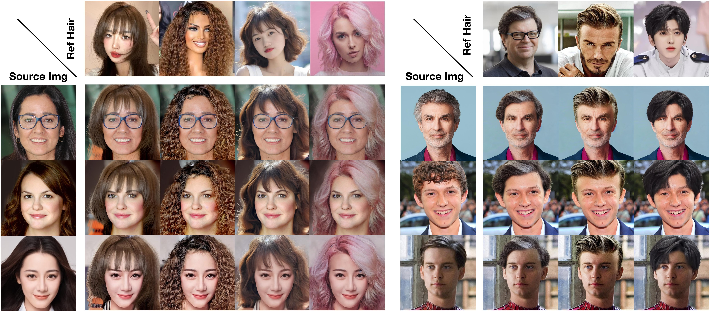
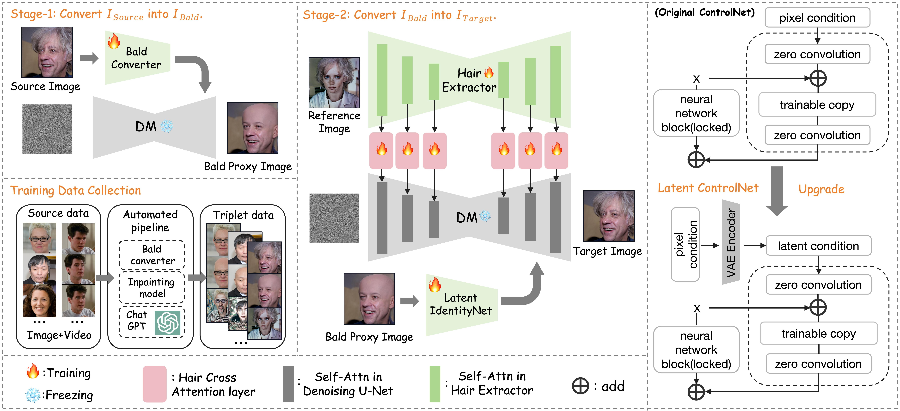

# Stable-Hair: Real-World Hair Transfer via Diffusion Model

<a href='https://xiaojiu-z.github.io/Stable-Hair.github.io/'></a>
<a href='https://arxiv.org/pdf/2407.14078'></a>

*[Yuxuan Zhang](https://scholar.google.com/citations?user=f2VoRWYAAAAJ&hl=en), Qing Zhang, [Yiren Song](https://scholar.google.com/citations?user=L2YS0jgAAAAJ&hl=en), [Jichao Zhang](https://zhangqianhui.github.io/), [Hao Tang](https://scholar.google.com/citations?user=9zJkeEMAAAAJ&hl=en), [Jiaming Liu](https://scholar.google.com/citations?user=SmL7oMQAAAAJ&hl=en)*



> This is a maintained fork of the [official Stable-Hair repo](https://github.com/Xiaojiu-z/Stable-Hair), updated to run on a modern machine. See [What changed](#what-changed-in-this-fork) for details.

## Abstract
Stable-Hair is a diffusion-based hair transfer framework that robustly transfers a
wide range of real-world hairstyles onto user-provided faces for virtual hair
try-on. It is a **two-stage pipeline**:

1. **Stage 1 — Bald Converter:** a Latent ControlNet trained alongside Stable
   Diffusion removes hair from the source face, producing a bald image.
2. **Stage 2 — Hair Transfer:** a *Hair Extractor* encodes the reference
   hairstyle while a *Latent IdentityNet* preserves identity and background,
   transferring the target hairstyle with high fidelity onto the bald image.



## Requirements
- **OS:** Linux (tested on Ubuntu 22.04)
- **Python:** 3.10+
- **GPU:** NVIDIA GPU with ≥ 8 GB VRAM and driver ≥ 520 (tested on an RTX A6000)
- **CUDA:** the pinned wheels are CUDA 11.8 builds; any recent driver works
- **Disk:** ~15 GB (≈6 GB pretrained weights + ≈4 GB base SD1.5 + environment)

## Quick Start
The included [`setup.sh`](setup.sh) creates a virtual environment, installs every
system + Python dependency, and downloads the pretrained weights into `models/`.

```bash
git clone <this-repo> hair-transfer
cd hair-transfer

./setup.sh                   # full setup: .venv + pretrained weights
# ./setup.sh --skip-weights  # build the environment only
# ./setup.sh --skip-env      # download the weights only

source .venv/bin/activate
python infer_full.py         # writes ./output/0.jpg
```

The base **Stable Diffusion 1.5** checkpoint
(`stable-diffusion-v1-5/stable-diffusion-v1-5`) is fetched from Hugging Face
automatically on first run.

### Manual setup
If you prefer to set things up by hand:

```bash
# System libraries (Debian/Ubuntu): venv, a C++ toolchain + CMake for dlib,
# and the shared libs OpenCV needs at runtime.
sudo apt-get install -y python3.10-venv build-essential cmake libgl1 libglib2.0-0 ffmpeg

python3 -m venv .venv && source .venv/bin/activate
pip install -r requirements.txt   # the cu118 --extra-index-url is baked into the file
```

### Pretrained weights
Download from [Google Drive](https://drive.google.com/drive/folders/1E-8Udfw8S8IorCWhBgS4FajIbqlrWRbQ?usp=drive_link)
(or just run `./setup.sh`) and arrange them as:

```
models/
├── stage1/
│   └── pytorch_model.bin        # Bald Converter (ControlNet)
└── stage2/
    ├── pytorch_model.bin        # Hair Extractor / reference encoder
    ├── pytorch_model_1.bin      # Adapter
    └── pytorch_model_2.bin      # Latent IdentityNet (ControlNet)
```

## Usage

### Inference
Edit the source/reference images and parameters in
[`configs/hair_transfer.yaml`](configs/hair_transfer.yaml), then:
```bash
python infer_full.py
```
The result (source · bald · reference · transferred) is written to `./output/`.

### Gradio demo
An interactive web UI:
```bash
python gradio_demo_full.py    # serves on http://0.0.0.0:8986
```

### Training
The two stages are trained separately. Adjust the data paths and the accelerate
config ([`default_config.yaml`](default_config.yaml)) for your setup, then:
```bash
bash train_stage1.sh   # Bald Converter
bash train_stage2.sh   # Hair Extractor + Latent IdentityNet
```

## Project structure
```
configs/             inference config (hair_transfer.yaml)
diffusers/           vendored, lightly-modified diffusers 0.23.1 (used at runtime)
ref_encoder/         Hair Extractor, Latent ControlNet, adapters, attention
utils/               StableHair pipelines (transfer + bald conversion)
test_imgs/           sample ID / reference images
infer_full.py        end-to-end inference entry point
gradio_demo_full.py  Gradio web demo
train_stage{1,2}.py  training scripts
setup.sh             environment + weights installer
```

## What changed in this fork
The upstream repo no longer runs out of the box; this fork fixes:

- **Dead base model.** `runwayml/stable-diffusion-v1-5` was removed from Hugging
  Face. Configs and training scripts now point at the maintained mirror
  `stable-diffusion-v1-5/stable-diffusion-v1-5`.
- **Dependency pins.** `torchvision` is corrected to `0.17.2+cu118` (it must match
  `torch 2.2.2`), and a `--extra-index-url` for the PyTorch CUDA 11.8 wheels is
  baked into `requirements.txt` so a plain `pip install -r requirements.txt` works.
- **diffusers version.** The pin is aligned to `0.23.1` to match the vendored
  `diffusers/` package the model code actually imports.
- **One-command setup.** Added `setup.sh` (system deps, venv, weight download with
  a manual-download fallback) and refreshed this README.

## Limitations
Results depend on the first stage — if the bald converter struggles, transfer
quality drops. The released model was trained on a relatively small, FFHQ-aligned
dataset (≈6k images for stage 1, ≈20k for stage 2), so it works best on cropped,
aligned, 512×512 face images.

## Citation
```bibtex
@misc{zhang2024stablehairrealworldhairtransfer,
      title={Stable-Hair: Real-World Hair Transfer via Diffusion Model},
      author={Yuxuan Zhang and Qing Zhang and Yiren Song and Jiaming Liu},
      year={2024},
      eprint={2407.14078},
      archivePrefix={arXiv},
      primaryClass={cs.CV},
      url={https://arxiv.org/abs/2407.14078},
}
```

## License
See [LICENSE](LICENSE).
